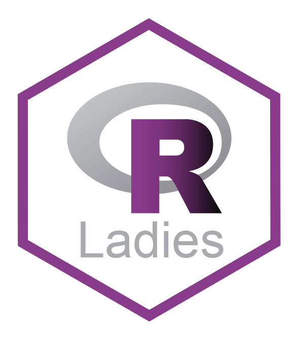

# meetup-presentations_jakarta

{width = 10px}

A local chapter of [R-Ladies Global](https://rladies.org/), R-Ladies Jakarta exists to promote gender diversity in the R community worldwide. R-Ladies Jakarta welcomes members of all R proficiency levels, whether you're a new or aspiring R user, or an experienced R programmer interested in mentoring, networking & expert upskilling. Our community is designed to develop our members' R skills & knowledge through social, collaborative learning & sharing. Supporting minority identity access to STEM skills & careers, the Free Software Movement, and contributing to the global R community!   

Stay up to date about R-Ladies Jakarta events: [https://www.meetup.com/rladies-jakarta/](https://www.meetup.com/rladies-jakarta/)

